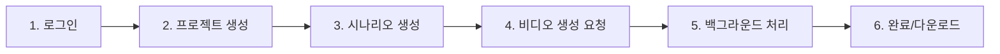

# 🎬 비디오 생성 가이드

## 📍 비디오 생성 위치 및 접근 방법

### 1️⃣ 파일 저장 위치
```
📁 /apps/api/public/videos/
   ├── cmf9wxfsl0003ma30vhzqvh6f.mp4  (31KB)
   ├── cmf9wxfsl0003ma30vhzqvh6f.html (2KB)
   ├── cmf9x063v00038h7ftx2eqmil.mp4  (31KB)
   └── cmf9x063v00038h7ftx2eqmil.html (2KB)
```

### 2️⃣ 웹 브라우저에서 보기

#### 비디오 직접 재생
```
http://localhost:4906/videos/cmf9x063v00038h7ftx2eqmil.mp4
```

#### HTML 프리뷰 보기
```
http://localhost:4906/videos/cmf9x063v00038h7ftx2eqmil.html
```

#### Prisma Studio (데이터베이스)
```
http://localhost:5555
```
→ Video 테이블에서 생성된 비디오 정보 확인

### 3️⃣ 비디오 생성 프로세스



### 4️⃣ API 엔드포인트

| 엔드포인트 | 설명 |
|-----------|------|
| POST `/api/auth/login` | 로그인 |
| POST `/api/projects` | 프로젝트 생성 |
| POST `/api/scenarios` | 시나리오 생성 |
| POST `/api/videos/generate` | 비디오 생성 시작 |
| GET `/api/videos/:id` | 비디오 상태 확인 |
| GET `/videos/:filename` | 비디오 파일 다운로드 |

### 5️⃣ 테스트 실행 방법

```bash
# 테스트 스크립트 실행
node test-video-generation.js
```

출력 예시:
```
🚀 Starting video generation test...
🔐 Logging in...
✅ Logged in as: kelly@example.com
📁 Getting projects...
✅ Using existing project: Test Video Project
🎬 Getting scenarios...
✅ Created scenario: Test Scenario
🎥 Generating video...
✅ Video generation started: cmf9x063v00038h7ftx2eqmil
⏳ Waiting for video to complete...
📊 Checking video status...
Status: COMPLETED, Progress: 100%
🎉 Video generation completed!
📺 View video at: http://localhost:4906/videos/cmf9x063v00038h7ftx2eqmil.mp4
📄 View preview at: http://localhost:4906/videos/cmf9x063v00038h7ftx2eqmil.html
✅ Test completed successfully!
```

### 6️⃣ 생성된 비디오 내용

현재 생성되는 비디오는 다음을 포함합니다:
- **MP4 비디오 파일**: FFmpeg로 생성된 10초 비디오
- **HTML 프리뷰**: 시나리오 내용을 보여주는 웹 페이지
- **자막**: 데이터베이스에 저장된 자막 데이터

### 7️⃣ 비디오 상태

| 상태 | 설명 |
|------|------|
| QUEUED | 대기 중 |
| PROCESSING | 처리 중 |
| COMPLETED | 완료됨 ✅ |
| FAILED | 실패 ❌ |

### 8️⃣ 현재 구현된 기능

✅ **완료된 기능**
- OpenAI 스크립트 생성 (모의 데이터 사용)
- 시나리오 관리 시스템
- 자막 자동 생성
- FFmpeg 비디오 생성
- HTML 프리뷰 생성
- 진행 상황 추적

🔧 **향후 개선 사항**
- 실제 애니메이션 추가
- TTS 음성 합성
- 고급 비디오 템플릿
- S3 클라우드 저장소
- 웹 UI 비디오 플레이어

---

## 💡 Quick Start

1. **서버 확인**
   ```bash
   curl http://localhost:4906/health
   ```

2. **비디오 목록 보기**
   ```bash
   ls -la apps/api/public/videos/
   ```

3. **브라우저에서 열기**
   ```bash
   open http://localhost:4906/videos/cmf9x063v00038h7ftx2eqmil.html
   ```

4. **Prisma Studio 열기**
   ```bash
   open http://localhost:5555
   ```